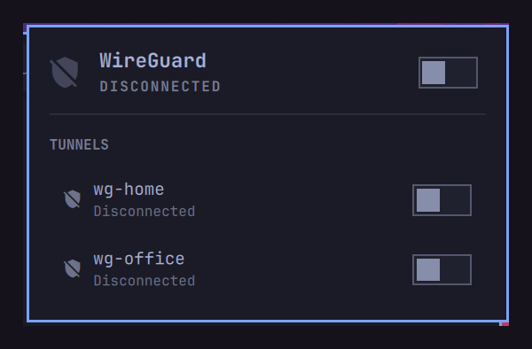

# WireGuard for Omarchy

A native [Omarchy](https://omarchy.org/) shell (Quickshell) bar widget that
shows WireGuard tunnel state and toggles tunnels with `wg-quick`. It replaces
the Omarchy 3 Waybar `custom/vpn` module, which does not carry over to the
Quickshell bar in Omarchy 4.



## Features

- Tunnel state in the bar, with the familiar shield glyphs
  (`󰦝` connected · `󰦞` disconnected · `󰻌` when `/etc/wireguard` is unreadable)
- **Left click** opens a panel listing every config in `/etc/wireguard`, each
  with its own on/off switch
- **Right click** toggles the primary tunnel without opening the panel
- **Middle click** forces a refresh
- Optional exclusive mode — bringing one tunnel up takes the others down
- Fully keyboard navigable
- No key material ever touches the widget: it reads tunnel *names* only, never
  config contents

## Install

```bash
omarchy plugin add https://github.com/wcoppens/omarchy-wireguard.git --enable
omarchy bar move wcoppens.wireguard --before omarchy.network   # optional placement
```

Update or remove later with `omarchy plugin update wcoppens.wireguard` /
`omarchy plugin remove wcoppens.wireguard`.

## Requirements

- Omarchy 4 (the Quickshell shell)
- `wireguard-tools` (`wg-quick`)
- One or more `/etc/wireguard/*.conf` tunnels
- A passwordless `sudo` rule for `wg-quick` (see below)

### Passwordless sudo

Status polling uses `ip -o link show type wireguard` and needs **no**
privileges. Only listing configs and running `wg-quick` do. Grant just those,
so the widget never triggers a password prompt:

```
# /etc/sudoers.d/wireguard-omarchy  (edit with: sudo visudo -f /etc/sudoers.d/wireguard-omarchy)
<youruser> ALL=(ALL) NOPASSWD: /usr/bin/wg-quick, /usr/bin/find /etc/wireguard -maxdepth 1 -name * -exec basename {} .conf \;
```

Without the rule the widget still shows any tunnel that is already up, but the
panel reports that it cannot read `/etc/wireguard` and toggling fails with a
short message rather than hanging on a password prompt.

## Settings

Set these inline on the widget's entry in `~/.config/omarchy/shell.json`
(or through the shell's plugin settings UI):

| Key | Type | Default | Meaning |
|-----|------|---------|---------|
| `refreshIntervalSec` | integer | `5` | How often tunnel state is polled |
| `exclusive` | boolean | `true` | Bringing a tunnel up takes the others down first |
| `defaultTunnel` | string | `""` | Tunnel used by right click when none is up |

## Keyboard shortcuts (inside the panel)

| Key | Action |
|-----|--------|
| `j` / `k` or arrows | Move the cursor |
| `enter` / `space` | Toggle the selected tunnel |
| `t` | Toggle the primary tunnel |
| `r` | Refresh |
| `esc` | Close |

## How it works

Two deliberately separate privilege paths:

1. **Status poll (unprivileged).** `ip -o link show type wireguard` lists live
   tunnels every few seconds without ever calling `sudo`.
2. **Actions (least-privilege sudo).** Listing configs goes through the
   sudoers-allowed `find`; up/down runs one `wg-quick` call per tunnel. Because
   the sudoers rule grants `wg-quick` itself — never a shell — "exclusive" mode
   is a plain unprivileged `sh -c` that elevates each `wg-quick` call
   individually, each of which matches the rule. Tunnel names are shell-quoted
   before they ever reach that command.

## Development

Pure parsing and command-building live in `Model.js` with no QML dependencies,
so they run and test under plain Node:

```bash
node tests/model.test.js
omarchy plugin validate .
```

## License

MIT — see [LICENSE](LICENSE).
